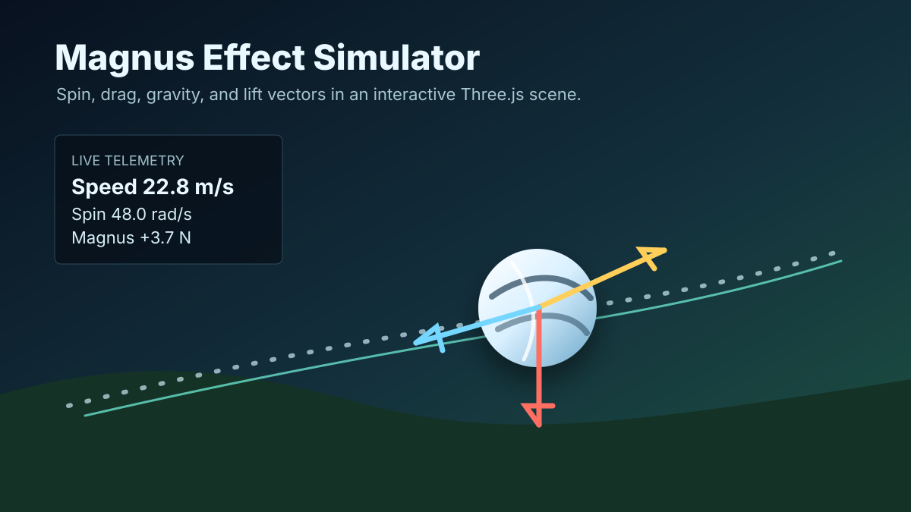
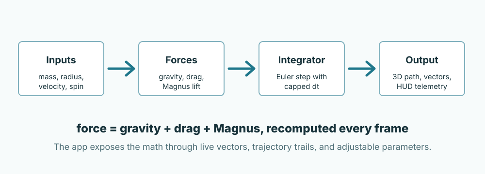

# Magnus Effect Physics Simulation

An interactive Three.js simulation that shows how a spinning ball curves in flight under gravity, drag, and the Magnus force.



## Why It Exists

This project was built for Richard Abou Jamra's Physics Extended Essay. The goal is to make the Magnus Effect visible: instead of only reading equations, you can launch a ball, adjust its spin and environment, then watch the trajectory and force vectors update in real time.

## What It Shows

- A 3D ball trajectory rendered with Three.js.
- Velocity, gravity, drag, and Magnus force arrows.
- A trail that makes the curve of the path easy to inspect.
- Live telemetry for speed, angular velocity, position, and elapsed time.
- Adjustable mass, radius, gravity, fluid density, viscosity, launch velocity, and spin axis.
- Orbit, pan, zoom, follow-ball, and top-view camera controls.

## Physics Flow



Each frame computes the net force from the current physical state, integrates the velocity and position, decays spin through a damping term, and redraws the scene.

## Equations

| Quantity | Formula |
| --- | --- |
| Gravity | `F_g = m g` |
| Drag | `F_d = 0.5 rho Cd A v^2` |
| Magnus | `F_m = 0.5 rho CL A r (omega x v)` |
| Spin decay | `omega_next = omega (1 - mu dt)` |

Symbols:

| Symbol | Meaning |
| --- | --- |
| `rho` | fluid density |
| `Cd` | drag coefficient |
| `CL` | lift coefficient |
| `A` | cross-sectional area, `pi r^2` |
| `omega` | angular velocity vector |
| `v` | linear velocity vector |
| `mu` | viscous damping factor |

The simulation uses Euler integration with a capped frame timestep of 20 ms to keep the motion stable when the browser frame rate changes.

## Run It

Open `index.html` in a modern browser:

```text
index.html
```

No build step, package install, or backend is required.

## Controls

| Input | Action |
| --- | --- |
| Left-click drag | Orbit the camera |
| Right-click drag | Pan |
| Scroll wheel | Zoom |
| W / S | Move camera forward / backward |
| A / D | Strafe left / right |
| Arrow keys | Orbit with the keyboard |
| Launch | Start the simulation with current settings |
| Pause | Pause or resume |
| Reset | Reset the ball and trails |
| Follow Ball | Move the camera behind the ball |
| Top View | Switch to a bird's-eye view |
| Panel | Show or hide the settings panel |

## Good Experiments To Try

- Increase spin while keeping launch velocity fixed and compare the curve.
- Reverse the spin axis and watch the lift direction flip.
- Lower fluid density and observe how both drag and Magnus lift weaken.
- Increase mass and compare how much the same force changes the path.
- Move between follow-ball and top-view modes to inspect different parts of the trajectory.

## Tech Stack

- Three.js r134
- Vanilla HTML, CSS, and JavaScript
- OrbitControls
- Browser-native canvas rendering

## Limitations

This is an educational simulation, not a computational fluid dynamics solver. It uses a simplified sphere model, fixed drag/lift coefficients, Euler integration, and idealized environmental parameters. It is best read as an interactive explanation of the physics rather than a prediction tool for a specific real ball.

---

Created by Paul Nercessian.
